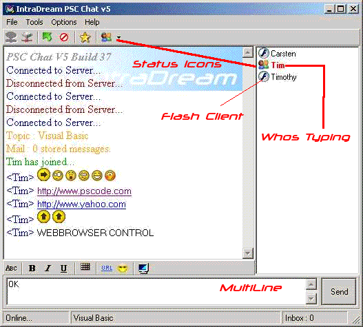



## PSC Chat 5

### Description

PSC Chat 5 is a Chat room we made for pscode.com this new version supports Scripting , FileTransfer, Whiteboard, Status Icons, Admin Functions, Whos Typing, PM's, Nice GUI and alot more. I hope that all of you try PSC Chat5 and hope that you enjoy this new version of Psc Chat. We have been making this server very stable and secure based on an acces DB much more secure than v4 server. THER IS NOW A FLASH CLIENT you may try it befor u download at http://idream.no-ip.com:56/Client.swf . as is always the case with pscchat all aspects are open source client/server/flash client included. We hope to have the Server running 24/7, so if you find the servers down please don’t be mad and give up your hopes. I would also like to thank everyone that participated in this project. The IntraDream Team, Carsten Dressler, Timothy Marin
 
### More Info
 

             |
---                |---
**Submitted On**   |2003-05-04 19:21:44
**By**             |[Timothy Marin](https://github.com/Planet-Source-Code/PSCIndex/blob/master/ByAuthor/timothy-marin.md)
**Level**          |Advanced
**User Rating**    |4.8 (96 globes from 20 users)
**Compatibility**  |VB 6\.0
**Category**       |[Internet/ HTML](https://github.com/Planet-Source-Code/PSCIndex/blob/master/ByCategory/internet-html__1-34.md)
**World**          |[Visual Basic](https://github.com/Planet-Source-Code/PSCIndex/blob/master/ByWorld/visual-basic.md)
**Archive File**   |[PSC\_Chat\_5158360542003\.zip](https://github.com/Planet-Source-Code/timothy-marin-psc-chat-5__1-45259/archive/master.zip)

